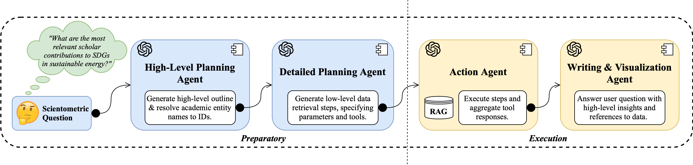

# llm-agents-scientometric-qa



This repository contains the template code and prompts for the paper *"AnalyticsGPT: A Multi-Agent LLM Workflow for Scientometric Question
Answering,"* an ACL 2025 Industry Track submission. 

The code has been stripped of implementation-specific code relating to company intellectual property, e.g. specific tool parameters and API endpoints.

## Directory
```
.
├── agents.py
├── app.py
├── config
│   └── prompts
│       ├── action.py
│       ├── high_level_planning.py
│       ├── naive.py
│       ├── planning.py
│       ├── tools.py
│       └── writing.py
├── data
│   ├── data_without_users.csv
│   └── raw
├── graphql.py
├── llm_client.py
├── logger
│   ├── MyThread.py
│   └── logger.py
├── pipeline.py
├── prompt_templates.py
├── sessions
│   ├── completed_sessions
│   ├── incomplete_session
│   └── incomplete_sessions_archive
├── tools_api.py
└── utils.py
```

## Setup

### Mandatory Configuration Steps

After installing the necessary packages, configure the LLM client in `llm_client.py` with the appropriate environment variables. Our implementation uses the `AzureChatOpenAI` model integration from LangChain, but this is of course not mandatory.

Concerning the RAG interface, there are 4 components to consider:
- The entity resolution component in `graphql.py`. While our implementation used a proprietary GraphQL layer aggregating numerous entity vector search endpoints, any entity resolution method (name -> ID and v.v.) can work in principle.
- The implementations of the database querying tools in `tools_api.py`.
- The functional description of said tools as provided to the Planning Agent for plan generation in `config/prompts/planning.py`.
- The functional descriptions of said tools in `config/prompts/tools.py` specified as Pydantic models, for LLM tool-calling purposes.

> [!NOTE]
> We leave a skeleton of our implementation in these files for reference - naturally, this example will not work out of the box.

To couple your own RAG module to the workflow and have the system run end-to-end, these components must be updated accordingly.

### Other Configuration Options

Most major aspects of the workflow can be customized to your own concrete implementation:
- Each agent's definition can be changed in `agents.py` (inheriting from the `BaseAgent` abstract class) and `prompt_templates.py`. The actual prompt literals are located in `config/prompts`.
- Similarly, the pipeline, i.e. agent execution and intermediate steps, in `pipeline.py` using the `BasePipeline` abstract class can be updated.

> [!TIP]
> For ease of integration, if adjusting the planning agent prompt, ensure the output format of each step still corresponds to `agents.py/PlanStep`.

## Dataset

For privacy reasons, we do not release the full list of user questions in our evaluation dataset, beyond the limited examples given in the paper. However, the 50 synthetic examples sampled from [DBLP-QuAD (Banerjee et al. 2023)](https://arxiv.org/abs/2303.13351) are available in `data/data_without_users.csv`.
